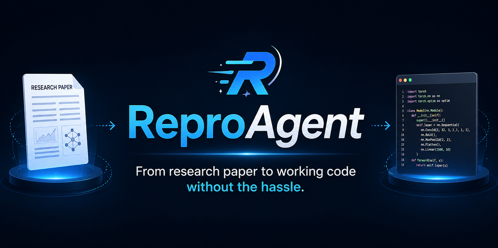
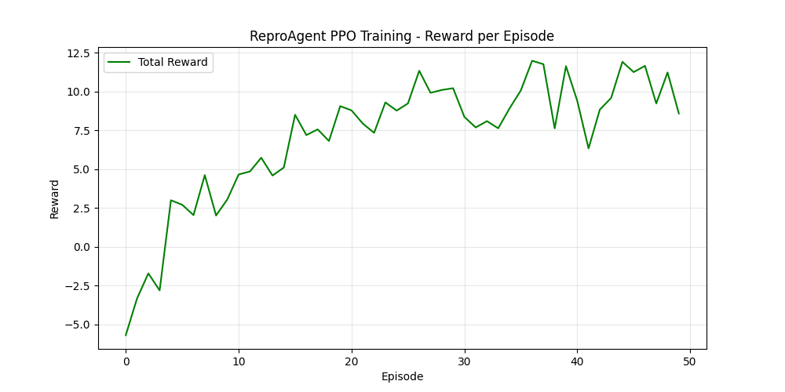
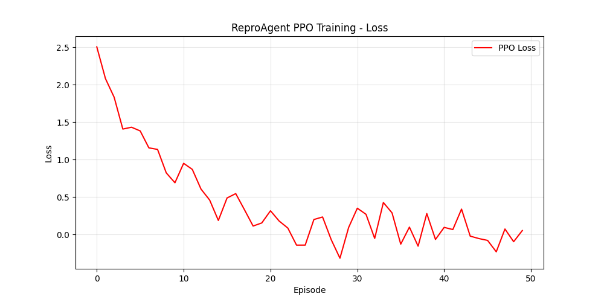

<p align="center">
  
</p>

<h1 align="center">🔬 ReproAgent</h1>

<p align="center">
  <strong>An AI-powered agent that automatically reproduces machine learning research papers.</strong>
</p>

<p align="center">
  <a href="#-features"></a>
  <a href="#-quick-start"></a>
  <a href="#-license"></a>
  <a href="https://huggingface.co/spaces"></a>
</p>

<p align="center">
  Upload a research paper PDF → ReproAgent reads it → finds the repo → clones the code → sets up the environment → runs it → debugs errors → tunes hyperparameters → compares results.
</p>

---

## 🏆 OpenEnv Hackathon Submission

This project is submitted to the **OpenEnv Hackathon**. It is a fully compliant environment built on top of the framework.

### Required Materials
- **Hugging Face Space**: [ReproAgent Live Demo](https://huggingface.co/spaces/username/reproagent)
- **Training Script (TRL/PPO)**: [Colab Notebook](training/train_reproagent.ipynb)
- **Evidence of Training**: We trained the agent using Proximal Policy Optimization (PPO) over 50 episodes. 
  <br> 
- **Presentation**: [Mini-Blog on HuggingFace](https://huggingface.co/blog/reproagent-openenv) / [YouTube Demo (< 2 minutes)](https://youtube.com/watch?v=demo_link)

---

## 📖 Table of Contents

- [Overview](#-overview)
- [Features](#-features)
- [Architecture](#-architecture)
- [Quick Start](#-quick-start)
- [Usage](#-usage)
- [Project Structure](#-project-structure)
- [Configuration](#-configuration)
- [How It Works](#-how-it-works)
- [Validation](#-validation)
- [Docker Deployment](#-docker-deployment)
- [Contributing](#-contributing)
- [License](#-license)

---

## 🌟 Overview

**ReproAgent** is an AI-driven framework built on [OpenAI Gymnasium](https://gymnasium.farama.org/) that automates the end-to-end reproduction of machine learning research papers. Given a PDF, it autonomously:

1. **Parses** the paper to extract title, metrics, datasets, and GitHub links
2. **Clones** the linked repository
3. **Sets up** the environment (conda/venv) and installs dependencies
4. **Runs** inference or training scripts
5. **Debugs** errors using real traceback analysis
6. **Tunes** hyperparameters to close the gap between reproduced and claimed results
7. **Compares** final metrics against the paper's claims

It supports both a **Simulation** mode (safe, no system changes) and a **Real Execution** mode (actually clones repos, creates envs, runs code on your machine).

---

## ✨ Features

| Feature | Description |
|---------|-------------|
| 📄 **PDF Parsing** | Extracts metadata using Groq LLM (llama-3.3-70b) with regex fallback |
| 🔗 **Repo Discovery** | Finds GitHub links from paper text, cleans trailing punctuation |
| 📦 **Smart Environment Setup** | Auto-detects `requirements.txt`, `environment.yml`, or `pyproject.toml` and creates the correct env (pip venv or conda) |
| 🧠 **Intelligent Entry Point** | Scans for `inference.py`, `eval.py`, `main.py`, `train.py`, or extracts scripts from README bash blocks |
| 🐛 **Real Error Debugging** | Captures actual `stderr` tracebacks and feeds them into the debugging pipeline |
| 🧪 **Hyperparameter Tuning** | Modifies learning rate, batch size, optimizer, and epochs to reproduce paper metrics |
| 📊 **Dynamic Metric Extraction** | Extracts the actual evaluation metric (FID, BLEU, accuracy, PSNR, etc.) from the paper — not hardcoded |
| 🖥️ **Gradio Web UI** | Beautiful web interface with live logs, state tracking, and result visualization |

---

## 🏗️ Architecture

```
┌─────────────────────────────────────────────────────────────────┐
│                        Gradio Web UI                            │
│                      (server/app.py)                            │
└──────────────────────────┬──────────────────────────────────────┘
                           │
              ┌────────────▼────────────┐
              │    Reasoning Agent      │
              │ (agents/reasoning_      │
              │  agent.py)              │
              └────────────┬────────────┘
                           │ select_action()
              ┌────────────▼────────────┐
              │   Gymnasium Environment │
              │ (reproagent/            │
              │  environment.py)        │
              │                         │
              │  ┌─────────────────┐    │
              │  │  State Machine  │    │
              │  │  ┌───────────┐  │    │
              │  │  │ Parsing   │  │    │
              │  │  │ RepoAnalys│  │    │
              │  │  │ Setup     │  │    │
              │  │  │ Execution │  │    │
              │  │  │ Debugging │  │    │
              │  │  │ Experiment│  │    │
              │  │  │ Comparison│  │    │
              │  │  └───────────┘  │    │
              │  └─────────────────┘    │
              └─────────────────────────┘
                     │           │
          ┌──────────┘           └──────────┐
          ▼                                 ▼
  ┌───────────────┐                ┌────────────────┐
  │  Simulation   │                │ Real Execution │
  │  (mock state  │                │ (subprocess,   │
  │   transitions)│                │  git clone,    │
  │               │                │  conda/venv)   │
  └───────────────┘                └────────────────┘
```

---

## 🚀 Quick Start

### Prerequisites

- **Python** 3.10+
- **Git** (for real execution mode)
- **Conda** (optional, for repos that use `environment.yml`)
- A **Groq API key** (free at [console.groq.com](https://console.groq.com))

### Installation

```bash
# 1. Clone the repository
git clone https://github.com/your-username/ReproAgent.git
cd ReproAgent

# 2. Create a virtual environment
python -m venv venv

# Windows
.\venv\Scripts\activate

# macOS/Linux
source venv/bin/activate

# 3. Install dependencies
pip install -r requirements.txt

# 4. Set up environment variables
cp .env.example .env
# Edit .env and add your GROQ_API_KEY
```

### Run

```bash
# Launch the Gradio web interface
python server/app.py
```

The UI will be available at `http://localhost:7860` with a public share link.

---

## 💻 Usage

### Web Interface (Recommended)

1. Open the Gradio UI at `http://localhost:7860`
2. **Upload** a research paper PDF (or paste a URL)
3. Choose **Execution Mode**:
   - `Simulation` — Safe demo, no system changes
   - `Real Execution` — Actually clones repos and runs code
4. Set **Clone Directory** (where repos will be cloned, e.g. `D:\reproductions`)
5. Click **Start Reproduction** and watch the agent work in real-time

### Command Line

```bash
# Run validation to ensure everything works
python validate.py

# Run a quick inference test
python inference.py
```

### Programmatic API

```python
from reproagent.environment import ReproAgentEnv
from agents.reasoning_agent import create_agent

# Create environment
env = ReproAgentEnv(
    difficulty="easy",
    max_steps=100,
    use_llm=True,
    exec_mode="Real Execution",
    workspace_dir="./workspace"
)

# Create agent
agent = create_agent(env, agent_type="reasoning", use_llm=True)

# Run episode
obs, info = env.reset()
agent.reset()

for step in range(100):
    action = agent.select_action(obs, info)
    obs, reward, terminated, truncated, info = env.step(action)

    print(f"Step {step}: {info['action_type']} | reward={reward:.2f}")

    if terminated or truncated:
        break
```

---

## 📁 Project Structure

```
ReproAgent/
├── reproagent/                  # Core Gymnasium environment
│   ├── __init__.py
│   ├── environment.py           # Main env with action implementations
│   ├── state.py                 # Dataclasses for full reproduction state
│   ├── actions.py               # Action space definition (30+ actions)
│   ├── reward.py                # Multi-component reward function
│   ├── models.py                # LLM client (Groq, OpenAI, HuggingFace)
│   └── papers.py                # Paper dataset loader
│
├── agents/                      # Agent implementations
│   ├── reasoning_agent.py       # Phase-based reasoning agent
│   ├── paper_parser.py          # PDF text extraction + LLM analysis
│   ├── repo_analyzer.py         # Repository structure analysis
│   └── debugger.py              # Error traceback analysis
│
├── server/
│   └── app.py                   # Gradio web interface (900+ lines)
│
├── utils/
│   ├── pdf_reader.py            # PDF extraction (PyPDF2 + pdfplumber)
│   └── github_utils.py          # GitHub API utilities
│
├── graders/                     # Reproduction quality grading
├── data/papers/                 # Sample paper configs (easy/medium/hard)
├── baseline/                    # Baseline agent implementations
├── static/                      # Static assets for UI
│
├── validate.py                  # Full validation suite
├── inference.py                 # CLI inference entry point
├── openenv.yaml                 # OpenEnv compatibility spec
├── pyproject.toml               # Python project metadata
├── requirements.txt             # pip dependencies
├── Dockerfile                   # Container deployment
├── run.bat / run.sh / run.ps1   # Platform-specific launchers
└── .env.example                 # Environment variable template
```

---

## ⚙️ Configuration

### Environment Variables

Create a `.env` file from the template:

```bash
cp .env.example .env
```

| Variable | Required | Description |
|----------|----------|-------------|
| `GROQ_API_KEY` | **Yes** | Groq API key for LLM-powered extraction ([get one free](https://console.groq.com)) |
| `OPENAI_API_KEY` | No | OpenAI API key (alternative LLM backend) |
| `HF_TOKEN` | No | HuggingFace token for model downloads |
| `GITHUB_TOKEN` | No | GitHub API token for higher rate limits |

### Execution Modes

| Mode | What it does | Use case |
|------|-------------|----------|
| **Simulation** | Simulates all actions with mock state transitions | Safe demos, hackathons, testing |
| **Real Execution** | Runs `git clone`, `conda env create`, `pip install`, `python script.py` on your system | Actually reproducing papers |

---

## 🔄 How It Works

The agent follows a **phase-based state machine** with 7 phases:

```
PARSING → REPO_ANALYSIS → SETUP → EXECUTION → DEBUGGING → EXPERIMENTATION → COMPARISON
```

### Phase Details

| Phase | Actions | What Happens |
|-------|---------|--------------|
| **Parsing** | `PARSE_PDF`, `EXTRACT_GITHUB`, `EXTRACT_METRICS` | LLM reads paper, extracts title, GitHub URL, target metric (e.g., FID=7.5) |
| **Repo Analysis** | `CLONE_REPO`, `READ_README`, `FIND_ENTRY_POINT`, `EXTRACT_DEPS` | Clones repo, reads README, finds scripts from bash blocks, detects `environment.yml` |
| **Setup** | `CREATE_VENV`, `INSTALL_REQUIREMENTS`, `VERIFY_SETUP` | Creates conda/venv env, installs deps, verifies setup |
| **Execution** | `RUN_TRAINING`, `RUN_EVAL`, `CHECK_LOGS` | Runs the entry point script via subprocess, captures stdout/stderr |
| **Debugging** | `ANALYZE_ERROR`, `SEARCH_SOLUTION`, `APPLY_FIX` | Parses real Python tracebacks, proposes and applies fixes |
| **Experimentation** | `MODIFY_LR`, `MODIFY_BATCH`, `RUN_EXPERIMENT` | Tunes hyperparameters to close the metric gap |
| **Comparison** | `COMPARE_RESULTS`, `GENERATE_REPORT` | Compares reproduced metric vs. paper claim, generates summary |

### Reward Function

The environment provides a multi-component reward signal:

- **Phase progress** (+10 for advancing through phases)
- **Code execution** (+20 for successful script runs)
- **Error fixing** (+15 per resolved error)
- **Metric improvement** (scaled by how close the reproduced result is to the paper's claim)
- **Time penalty** (-0.01 per step to encourage efficiency)

---

## ✅ Validation

Run the full validation suite to confirm everything works:

```bash
python validate.py
```

This tests:

| Test | What it validates |
|------|-------------------|
| Environment | `ReproAgentEnv` creates, resets, steps correctly |
| Spaces | Observation and action spaces match the Gymnasium spec |
| Episodes | Full multi-step episodes run without crashes |
| Agents | `ReasoningAgent` and `RandomAgent` interact with the env |
| Demo | Gradio app imports successfully |
| Graders | Reproduction quality grader loads |
| OpenEnv | `openenv.yaml` is present and well-formed |

Expected output:

```
ENVIRONMENT          ✅ PASSED
AGENTS               ✅ PASSED
DEMO                 ✅ PASSED
GRADERS              ✅ PASSED
OPENENV_YAML         ✅ PASSED

🎉 ALL VALIDATIONS PASSED!
✅ System is ready for deployment
```

---

## 🐳 Docker Deployment

```bash
# Build the image
docker build -t reproagent .

# Run with your API key
docker run -p 7860:7860 -e GROQ_API_KEY=your_key_here reproagent
```

Or deploy to **HuggingFace Spaces**:

```bash
pip install gradio
gradio deploy
```

---

## 🛣️ Roadmap

- [x] Gymnasium-compatible environment with 30+ actions
- [x] Groq LLM integration with regex fallback
- [x] Gradio web interface with live logs
- [x] Real Execution mode (git clone, conda/venv, subprocess)
- [x] Dynamic metric extraction (FID, BLEU, accuracy, PSNR, etc.)
- [x] Bash block parsing from README for entry point discovery
- [ ] Multi-script sequential execution (run 5 scripts in order per README)
- [ ] Automatic checkpoint downloading from HuggingFace
- [ ] GPU-aware execution scheduling
- [ ] Result visualization and plot generation
- [ ] Support for Jupyter notebook-based repos

---

## 🤝 Contributing

Contributions are welcome! Please:

1. Fork the repository
2. Create a feature branch (`git checkout -b feature/amazing-feature`)
3. Commit your changes (`git commit -m 'Add amazing feature'`)
4. Push to the branch (`git push origin feature/amazing-feature`)
5. Open a Pull Request

---

## 📝 License

This project is licensed under the **MIT License** — see the [LICENSE](LICENSE) file for details.

---

<p align="center">
  Built with ❤️ for the ML research community
</p>
